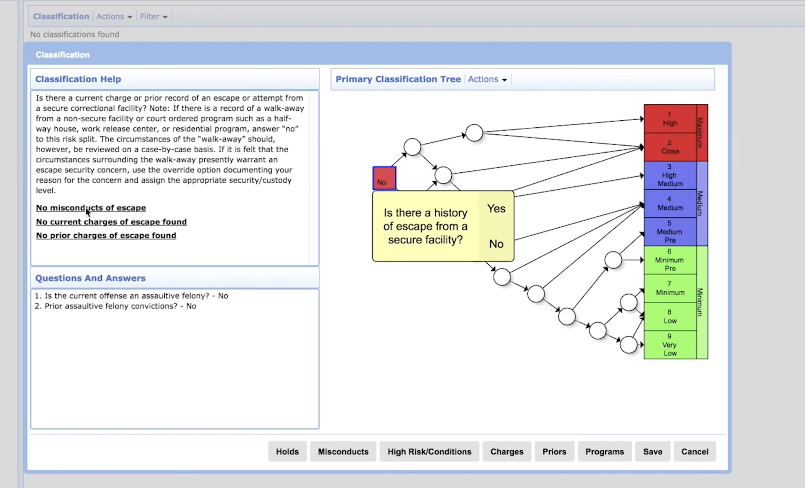

# ethicsML
A study on fairness and ethics of ML via COMPAS

## Context
COMPAS is a proprietary piece of software that has been designed to help judges in the US to make decisions in trials.
In praticular, COMPAS tries to predict whether a defendant is likely to recidive in the near future.
They provide a scale of risk to recidive serving to output a category via a simple mapping.
The first one is a score from 1 to 10 which is the prediction of COMPAS.
Then, a mapping is done to transform this score into one of the three categories: "Low", "Medium", "High".
The mapping is apparently done as follows: from 1 to 4, the associated category is "Low"; from 5 to 7, the output is "Medium"; and "High" for scores between 8 and 10.
Propublica has conducted a study asking to see records of people that commited crimes from the Broward County in Florida and conducted their study over a two year timeframe.
Propublica showed that COMPAS gives biased decisions in favor of white americans and harsher decisions for afro-american people (i.e., stating that afro-americans have higher risks to recidive).
Conclusions of Propublica focused on these two categories certainly because they are the two most represented in the data set (i.e., 85% of the dataset with around 51% of afro-american and 34% of white defendants).
The study, a github repo to reproduce computations as well as the response to the study are given under the Refs section.

In the end, we want to assess that these biases exist and whether we can find ways to counter them via the use of adversarial Machine Learning.

### Background on COMPAS
The Correctional Offender Management Profiling for Alternative Sanctions (COMPAS) system was developed by Dr. Tim Brennan, the co-founder of Northpointe. This system offers 3 risk scales:

- Pretrial Release Risk scale
- Violent Recidivism scale
- General Recidivism scale

Interestingly, Northpointe claims that the offense for which the suspect is currently in trial is ignored ([Northpointe, “Practitioners Guide to COMPAS.”]). Also, depending on the desired risk scale, different elements are taken into account. For the general recidivism scale, where ProPublica also focused on, the main information comes from a [questionnaire](https://www.documentcloud.org/documents/2702103-Sample-Risk-Assessment-COMPAS-CORE.html). In this form, the following aspects are taken into account (including the violence of the current offense):

- Cognitive Behavioral: i.e. criminal thinking
- Criminal Associates/Peers
- Criminal Opportunity: "time in high crime situations, affiliation with high risk persons who often engage in illegal activities, an absence of pro-social or constructive activities (e.g. working, spending time with family, etc.), an absence of social ties, high boredom, high rest- lessness and being in a high risk age group", (Section 4.2.4, [Northpointe, “Practitioners Guide to COMPAS.”]).
- Criminal Involvement: i.e. multiple arrests, etc.
- Criminal Personality
- Criminal Thinking Self-Report
- Current Violence
- Family Criminality
- Financial Problems
- History of Non-Compliance
- History of Violence
- Boredom
- Residential Instability
- Social Adjustment
- Social Environment
- Social Isolation
- Socialization Failure
- Substance Abuse
- Education

### Technical details
The implementation details of COMPAS are unknown, but there are some clues. In (p. 55, [Singh et al, 2018]), the General Recidivism scale is described as a linear equation from a LASSO regression model according to the authors of that chapter, Tim Brennan and Dieterich (an employee at Northpointe). For other risk scales, they claim to use random forests, SVMs and "other ML methods"  (p. 72, [Singh et al, 2018]). However, in promotional video, Tim Brennan explains why his use of decision trees in the criminal justice system was so innovative at the time, alongside a screen capture of that system.

## Challenges
First problem, since COMPAS is proprietary, we do not know technical details about it.
In particular, we do not know how COMPAS is implemented and thus whether it uses some machine learning technique to take its decision or whether it is a rule-based system.
Similarly, we do not know on which data it has been "trained" (or at least on what prior knowledge decisions are taken).
Adversarial Machine Learning applies on a Machine Learning based system using a derivable model, thus we need to approximate decisions taken by COMPAS with a Machine Learning model.
Because we do not know on which data set COMPAS has built his prior knowledge, we decided to use the Propublica data set (publically available on the github repo given under the Refs section).

Second, once we have successfully trained a mahcine learning model, we need to check that biases exist and/or try to find biases.

Finally, once the two previous points are satisfied, we can try to configure an adversarial machine learning attack on the learnt model.
We do not know exactly how existing adversarial machine learning attacks will behave and we might have to create a new one.

## Goals

The ultimate goal of this work is to find a configuration of an adversarial machine learning attack such that it will create new configuration/data that will counter-balanced existing biases.

## What can be found in this repo?

The repo is structured as follows:
 - the _data_ folder contains all used data. Inside are subfolders defined by file extensions. In the _csv_ subfolder are the data sample from Propublica for both predicting recidives and violent recidives (compas-scores-two-years*.csv). Other files are "sanitized" versions with some of the columns removed (because considered useless are not used at all by Propublica). Two files can be found one keeping age as values (integers) and one containing age category as defined in the Propublica study. The _arff_ folder contains the transformed version of "sanitized" data into the arff format which is used by Weka, a library containing various machine learning algorithms. Weka is only used as a preliminary study in order to try to answer the first challenge. Then, we plan to use scikit-learn and the Python language. Again, in this sub-folder, we multiplied the files by removing some columns regarding the prediction of COMPAS (one file contains the score between 1 and 10, another one  contains the risk categories: "Low", "Medium" and "High") or the actual groundtruth. Note that one file should exist for each combination of cases (prediction class *AND* age category or value).

 - the _script_ folder contains python scripts that we use to conduct our experiments.

 - the _results_ folder provides evidence which had lead us to our conclusions.

## TODO
- adapt all scripts to their particular contexts: depending on the target class (decile score, text score or Propublica groundtruth of recidive) and to ML parameterization

- try different ML algorithms: which ones? Decision Trees, SVM, Bayesian classifier, forests? etc.

## Refs
- COMPAS Wikipedia page: https://en.wikipedia.org/wiki/COMPAS_(software)
- Northpoint/equivant, the company which developed COMPAS: https://www.equivant.com/
- Propublica article about COMPAS: https://www.propublica.org/article/machine-bias-risk-assessments-in-criminal-sentencing
- Propublica description of their analysis: https://www.propublica.org/article/how-we-analyzed-the-compas-recidivism-algorithm
- Propublica github repo: https://github.com/propublica/compas-analysis/
- Equivant's response to the Propublica study: http://go.volarisgroup.com/rs/430-MBX-989/images/ProPublica_Commentary_Final_070616.pdf
- Equivant's webpage presenting the response: https://www.equivant.com/response-to-propublica-demonstrating-accuracy-equity-and-predictive-parity/
- [Northpointe, “Practitioners Guide to COMPAS.”] : http://www.northpointeinc.com/files/technical_documents/FieldGuide2_081412.pdf
- Risk assessment questionaire: https://www.documentcloud.org/documents/2702103-Sample-Risk-Assessment-COMPAS-CORE.html
- [Singh et al, 2018]: Singh, Jay P., et al., eds. Handbook of recidivism risk/needs assessment tools. John Wiley & Sons, 2018.
