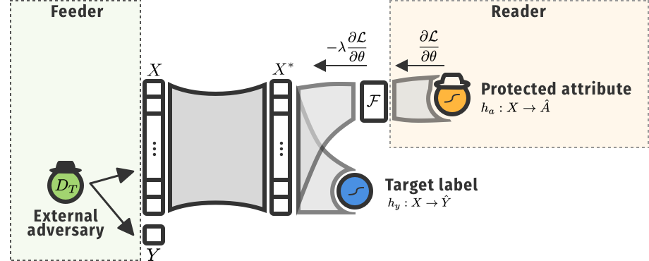

<p align="center"> 
    
 </p>


# Ethical adversaries

Our framework as described in for our paper ["Ethical Adversaries: Towards Mitigating Unfairness with Adversarial Machine Learning" on arXiv »](https://arxiv.org/abs/2005.06852)

# Get started
You can replicate the experiments from [our paper](https://arxiv.org/abs/2005.06852) by following the following steps.
You can install the required dependencies:
install using [Pipenv](https://pipenv.readthedocs.io/en/latest/) *(install by running `pip install pipenv` in your terminal)* by running `pipenv install`.

move to the src dir and run (for COMPAS):
```shell script
$ python main.py --epochs 50 --grl-lambda 50 --batch-size 128 --attack-size 10 --dataset compas --iterations 50 --save-dir ../results
```

We support 3 datasets that are in the repo, with the parameter: 

- COMPAS: `--dataset compas `
- Adult: `--dataset adult`
- German Credit: `--dataset credit`

For the settings of the hyper-parameters, we refer to our paper.


# The Ethical Adversaries framework



## Structure
Our framework uses a Feeder and an adversarial Reader. More info can be found in the [paper »](https://arxiv.org/abs/2005.06852)

## What can be found in this repo?

The repo is structured as follows:
 - the _data_ folder contains all used data. Inside are subfolders defined by file extensions. In the _csv_ subfolder are the data sample from Propublica for both predicting recidives and violent recidives (compas-scores-two-years*.csv). Other files are "sanitized" versions with some of the columns removed (because considered useless are not used at all by Propublica). Two files can be found one keeping age as values (integers) and one containing age category as defined in the Propublica study. The _arff_ folder contains the transformed version of "sanitized" data into the arff format which is used by Weka, a library containing various machine learning algorithms. Weka is only used as a preliminary study in order to try to answer the first challenge. Then, we plan to use scikit-learn and the Python language. Again, in this sub-folder, we multiplied the files by removing some columns regarding the prediction of COMPAS (one file contains the score between 1 and 10, another one  contains the risk categories: "Low", "Medium" and "High") or the actual groundtruth. Note that one file should exist for each combination of cases (prediction class *AND* age category or value).

 - the _script_ folder contains python scripts that we use to conduct our experiments. Mainly 2 scripts can be found there: the script_factory_classifier.py which is in charge of creating the classifier Python objects out of scikit-learn module and return them to the main script called script_eval_perf_classif_age_category_decil_score.py. This last script is (for now) specific to the input file data/csv/scikit/compas_recidive_two_years_sanitize_age_category_jail_time_decile_score.csv and execute different ML algorithms parameterized differently and reports results.
 Some scripts mention of secML in the filename. These scripts are the one using the secML library which implements the adversarial ML attacks studied by the PRALab. These scripts reimplement the work done in the 3 other scripts (being: a ML model factory, a script to train a model and a script to perform the adversarial attack).

 - the _results_ folder provides evidence which had lead us to our conclusions.


## License and credits
This project is a joint work between KU Leuven and UNamur. This research was partly supported by EOS Verilearn project and received funding from the Flemish Government under the “Onderzoeksprogramma Artificiële Intelligentie (AI) Vlaanderen” programme. 

We also want to thank the [secML](https://secml.gitlab.io) developers from the PRALab (Pattern Recognition and Applications Laboratory, University of Cagliari, Sardegna, Italy).

We release our models and this code under MIT.

Even though MIT doesn't require it, we would like to ask if you could nevertheless cite our paper if it helped you!

```
@misc{delobelle2020ethical,
    title={Ethical Adversaries: Towards Mitigating Unfairness with Adversarial Machine Learning},
    author={Pieter Delobelle and Paul Temple and Gilles Perrouin and Benoît Frénay and Patrick Heymans and Bettina Berendt},
    year={2020},
    eprint={2005.06852},
    archivePrefix={arXiv},
    primaryClass={cs.LG}
}